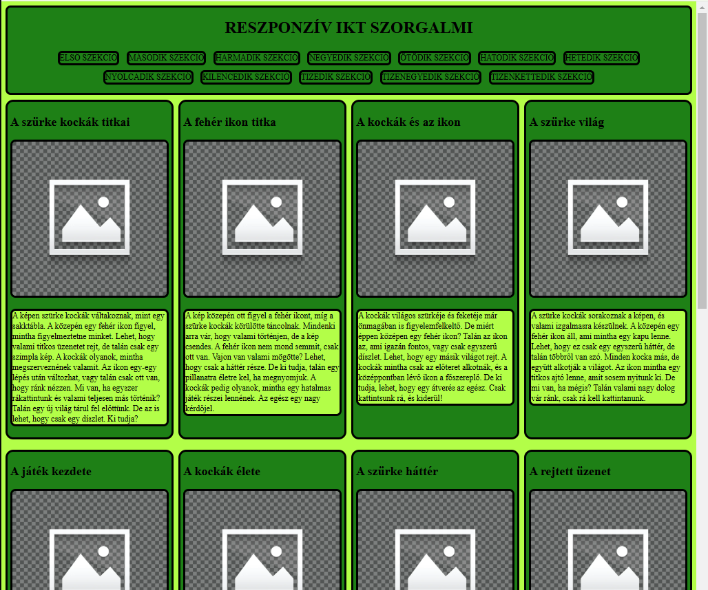
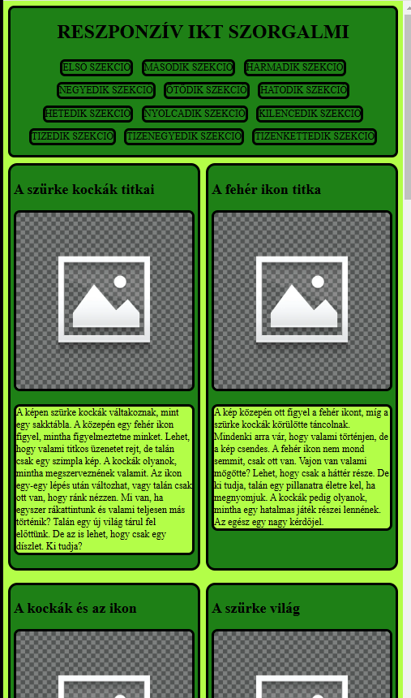
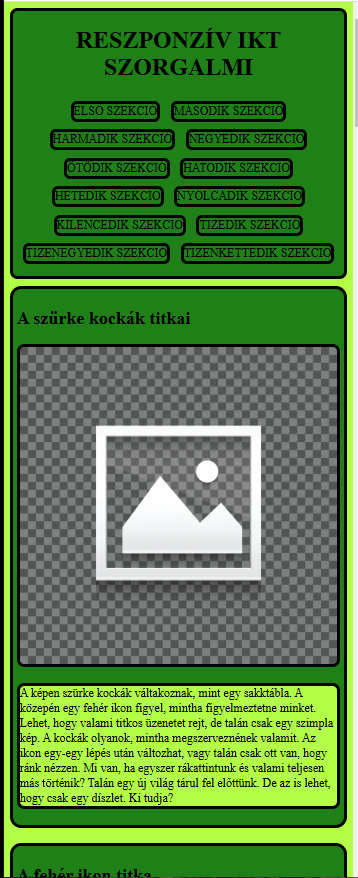

# HTML, CSS, id, class, grid, reszponzivitás gyakorlása

 
 
 

## HTML 

0. Csatold a stílusfájtl az oldalhoz! kész
1. Helyezd el az **a** tageket a megfelelő html5 szemantikus elem közé! asszem kész
2. Az article elemben minden h2, img és p taget helyezz el egy-egy section tag közé. kész
3. a sectin tageknek adj nevet úgy, hogy ha a linkekre kattintunk, az oldalon belül oda navigáljunk! kész

## CSS

1. Állítsd be az oldal hátterét greenyellow-ra! kész
2. a fejléc elemnek állíts be 5px, folytonos fekete szegélyt! kész
3. A fejlécben a szöveget igazítsd középre! kész
4. Az linkek ne legyenek aláhúzva! kész
5. A linkekre állíts 5px belső margót! kész
6. Ha  a linkek fölé viszem az egeret, a háttérszín legyen greenyellow! kész
7. A képek szélességét állítsd akkorára, hoyg mindig kitöltsék a rendelkezésre álló tároló méretét! kész
8. A section elemekre állíts 10px belső margót! kész
9. Az article elem legyen grid tároló! kész
10. Az article elemre állítsd be, hogy 4 egyforma széles oszlop legyen a rácsszerkezet! kész
11. Állíts töréspontot 800 pixelnél! Itt legyen két oszlopos a rács! kész
12. Állíts töréspontot 500 pixelnél! Itt legyen egy oszlopos a rács! kész

